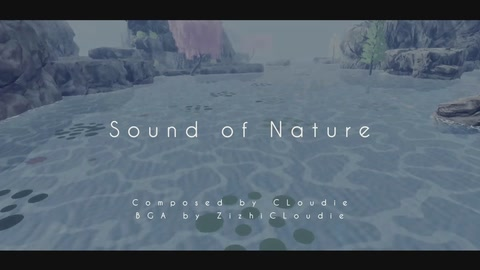

[返回目录](./)

> 此页面正在建设中，当前为模板自动生成，部分信息可能不完整  
> 如果您愿意参与填写，可以[点此](https://github.dev/mkzi-nya/milthm-calculator-web)进行修改并提交，或联系@mkzi_nya(qq: 2450382239)
> 或[点击此处](info:download)下载对应文档并编辑后发送至[此群](https://qm.qq.com/q/3lwpuT3l8A)（qq：699731287）

# Sound of Nature

## 曲目信息
| 曲名 | [Sound of Nature](info:info("Sound of Nature")) |
| - | - |
| 曲师 | 初云CLoudie |
| 曲绘 | ZizhiCLoudie |
| 所属曲包 | 露晓卉庭 |
| 更新版本 | v4.3 |
| 时长 | 02:31 |
| BPM | 208 |

## 谱面信息
| 难度 | [Drizzle](info:info("Sound of Nature", "Drizzle")) | [Sprinkle](info:info("Sound of Nature", "Sprinkle")) | [Cloudburst](info:info("Sound of Nature", "Cloudburst")) |
| - | - | - | - |
| 等级 | 2 (2.0) | 6+ (6.9) | 10+ (10.7) |
| 谱师 | Sound of Woof！ | 大只黄毛狗狗 | FurryDog running in the Nature |
| Note数量 | 328 | 563 | 1300 |

## 解锁方法

- 解锁曲包《露晓卉庭》后，在「露晓卉庭」功能花费菌菇 30 个、观赏 80 个解锁。

## 曲目试听

- [【Youtube】](https://youtu.be/RqUdG0I9Kz0)

## 曲目相关

(待补充)

## 游戏相关

(待补充)

## 谱面预览

- [Drizzle](https://storage.mhtl.im/chart/Drizzle_Sound_of_Nature.jpg)
- [Sprinkle](https://storage.mhtl.im/chart/Sprinkle_Sound_of_Nature.jpg)
- [Cloudburst](https://storage.mhtl.im/chart/Cloudburst_Sound_of_Nature.jpg)

